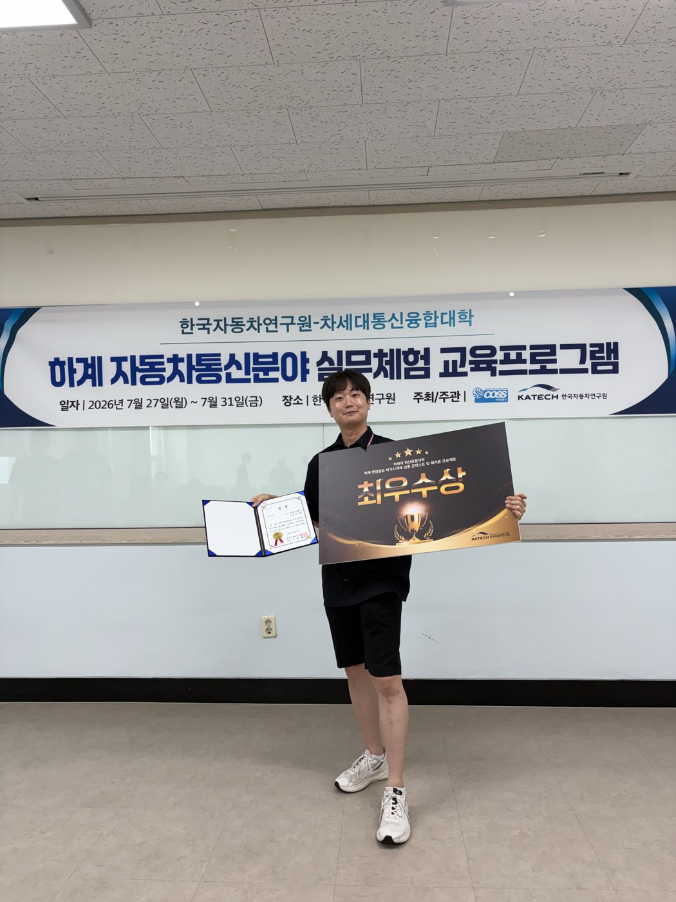
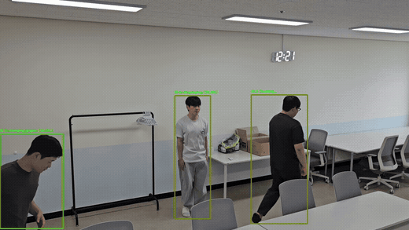
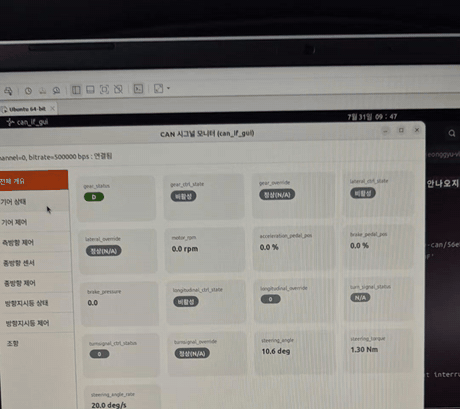

# KATECH 자동차 AI 실무체험 — 객체 검출 · 행동 인식 · 차량 통신

> **한국자동차연구원(KATECH) × 차세대통신융합대학(COSS)**
> 하계 자동차통신분야 실무체험 교육프로그램 · 2026.07.27 ~ 07.31
> **🏆 최우수상 수상** (비가시객체 검출 콘테스트 및 해커톤 프로젝트, 5조 / 전체 1위)

<p align="center">
  
</p>

---

## 한 줄 요약

5일간 KADaP GPUaaS 클러스터에서 **YOLO11 기반 3-클래스 객체 검출 모델을 mAP50-95 0.603 → 0.691로 개선**하고, 그 과정에서 **이미지 해시 기반 데이터 누수 감사(17% near-duplicate 검출)** 를 수행해 성능 수치 자체의 신뢰성을 검증했습니다. 여기에 행동 인식 파이프라인, CAN 통신 실습, 항공 안전 도메인 이식 아이디어를 더해 **최우수상**을 수상했습니다.

## 이 프로젝트에서 봐주셨으면 하는 것

| | |
|---|---|
| **성능을 올린 것보다, 성능 수치를 의심한 것** | mAP 0.871이라는 좋은 숫자가 나왔을 때 그대로 보고하지 않고, perceptual hash로 train/val 프레임 중복을 정량 측정했습니다. 결과적으로 **제공받은 사전학습 가중치가 COCO가 아니라 같은 데이터셋에 이미 fine-tuning된 모델**이라는 사실까지 찾아냈습니다. → [데이터 무결성 감사](docs/05-data-integrity-audit.md) |
| **한 번에 하나씩만 바꾸는 실험 설계** | 노이즈 하한(σ≈0.0089)을 먼저 측정하고, 그보다 작은 차이는 "개선"으로 채택하지 않았습니다. 채택한 실험만큼 **기각한 실험(TTA, 추론 해상도 스케일링)의 기각 사유**도 기록했습니다. → [실험 로그](docs/04-experiment-log.md) |
| **환경 트러블슈팅** | MIG GPU 인식 불일치, Ultralytics 경로 중복 버그, 학습/검증 imgsz 불일치로 인한 2.5%p 허수 등 실제로 시간을 잡아먹은 문제들을 원인까지 규명했습니다. → [환경 구축](docs/02-environment-kadap.md) |

---

## 목차

| 문서 | 내용 |
|---|---|
| [01. 프로그램 개요](docs/01-program-overview.md) | 커리큘럼, 일정, 평가 방식, 사전 준비 |
| [02. 개발 환경 (KADaP GPUaaS)](docs/02-environment-kadap.md) | 워크스페이스·워크로드 구성, Docker, conda, GPU 트러블슈팅 |
| [03. 객체 검출 (YOLO11)](docs/03-object-detection.md) | 데이터셋 분석, 하이퍼파라미터 설계 근거, 최종 성능 |
| [04. 실험 로그](docs/04-experiment-log.md) | 전체 실험 이력, 채택/기각 판단 기준 |
| [05. 데이터 무결성 감사](docs/05-data-integrity-audit.md) | 누수 검출·교정, 사전학습 가중치 오염 발견 |
| [06. 행동 인식](docs/06-action-recognition.md) | 검출 → 추적 → 행동 분류 파이프라인 |
| [07. CAN 통신](docs/07-can-communication.md) | CAN 프레임 구조, Kvaser, python-can, 실차 데이터 수집 |
| [08. 해커톤 프로젝트](docs/08-hackathon-project.md) | 자동차 인지 기술의 공항 안전 도메인 이식 |
| [09. 회고](docs/09-lessons-learned.md) | 배운 것, 놓친 것, 다음에 할 것 |

코드는 [`src/`](src/)에 있습니다.

---

## 핵심 결과

### 객체 검출 — 3 클래스 (vehicle / pedestrian / cycle)

| 구분 | mAP50 | mAP50-95 | 비고 |
|---|---|---|---|
| 최초 베이스라인 (YOLO11n, imgsz 1280) | — | 0.6030 | 시작점 |
| imgsz 1536 적용 | — | 0.6567 | 소형 객체 분석에 근거한 상향 |
| dfl / box 손실 가중치 튜닝 | 0.8818 | 0.6675 | 150 epochs |
| weight_decay 튜닝 | — | 0.6870 | 노이즈 하한의 1.8배 개선 |
| **YOLO11s + 누수 제거 검증셋** | 0.8694 | **0.6914** | 최종 |

> 전 구간에서 **pedestrian이 병목**이었습니다. 라벨 파일을 전수 파싱해 객체 크기를 측정한 결과 pedestrian의 55%가 32px 미만(소형 객체 기준)이었고, 이것이 imgsz를 최우선 레버로 선택한 근거가 되었습니다. 자세한 내용은 [03번 문서](docs/03-object-detection.md)에 있습니다.

### 행동 인식 — 검출 + 추적 + Kinetics 행동 분류

<p align="center">
  
</p>

객체 검출로 사람을 찾고, 추적으로 ID를 부여한 뒤, 각 ID의 프레임 시퀀스를 행동 분류 모델에 넣어 **Top-5 행동 클래스를 확률과 함께 출력**하는 파이프라인을 구성했습니다. → [06번 문서](docs/06-action-recognition.md)

### 차량 통신 — CAN 시그널 실시간 모니터링

<p align="center">
  
</p>

VMware 위 Ubuntu에 Kvaser USB-CAN을 패스스루로 물리고, 500 kbps 아이오닉 5에서 **조향각·조향 토크·각속도·RPM·방향지시등** 신호를 실시간으로 모니터링했습니다. 통상 ROS로 구성하는 부분을 **Claude Code CLI를 운용 셸로 사용**해 프로세스를 기동·감시·종료하는 방식으로 대체했고, 그 방식의 한계(실시간성 미보장, pub/sub 부재, 표준 기록 수단 부재)까지 함께 정리했습니다. → [07번 문서](docs/07-can-communication.md)

---

## 📦 Releases

용량 때문에 저장소에 포함하지 않은 원본 영상은 [Releases](../../releases/latest)에 첨부되어 있습니다.

| 파일 | 내용 |
|---|---|
| `action-detection-result.mp4` | 검출 + 추적 + 행동 인식 결과 영상 (1920×1080, 369프레임) |
| `can-signal-monitor.mp4` | CAN 시그널 실시간 모니터링 시연 (41초) |

---

## 기술 스택

**모델·프레임워크** — Ultralytics YOLO11 (n/s), PyTorch, Kinetics-400 기반 행동 인식 모델
**인프라** — KADaP GPUaaS (Astrago), NVIDIA A100 PCIe / H100 NVL / L40S, Docker, Kubernetes 기반 워크로드
**데이터·분석** — NumPy, OpenCV, Pillow, pandas, Matplotlib, perceptual hashing
**차량 통신** — CAN, python-can, SocketCAN, Kvaser USB-CAN, cantools/DBC
**환경·도구** — Linux(Ubuntu), VMware Workstation, conda/miniconda, JupyterLab, Claude Code CLI, Git

---

## 리포지토리 구조

```
.
├── README.md
├── docs/            # 실습 전 과정 기술 문서 (9편)
├── src/             # 학습 · 검증 · 데이터 분할 · CAN 예제 코드
└── assets/
    ├── screenshots/ # KADaP 플랫폼, 실습 환경
    └── results/     # 검출·행동인식 결과, 수상
```

---

<sub>본 리포지토리는 교육 프로그램 참여 기록을 정리한 개인 포트폴리오입니다. 실습에 사용된 데이터셋과 사전학습 가중치는 주관 기관의 자산이므로 포함하지 않았으며, 코드는 재현 가능한 형태로 재구성한 것입니다.</sub>
