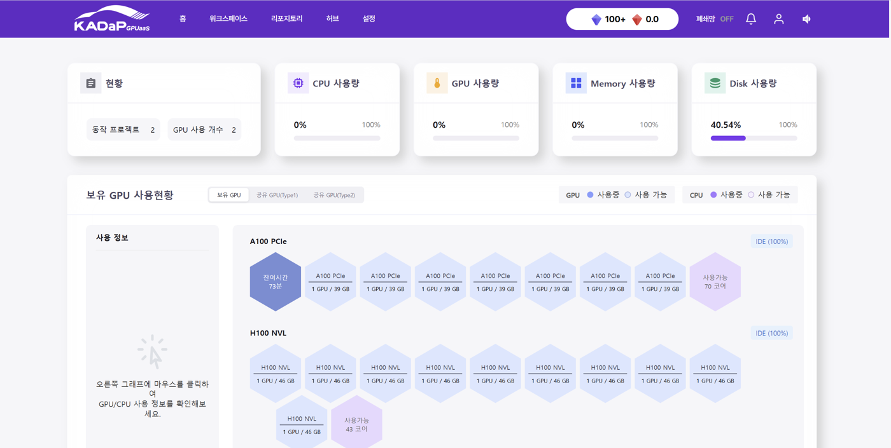

# 01. 프로그램 개요

## 기본 정보

| 항목 | 내용 |
|---|---|
| 프로그램명 | 하계 자동차통신분야 실무체험 교육프로그램 |
| 주최·주관 | 한국자동차연구원(KATECH), 차세대통신융합대학(COSS) |
| 기간 | 2026년 7월 27일(월) ~ 7월 31일(금), 5일 |
| 장소 | 한국자동차연구원 |
| 평가 | 비가시객체 검출 콘테스트(AI 모델 성능) + 해커톤 프로젝트(발표) |
| 결과 | **최우수상** (5조) |

## 커리큘럼 흐름

프로그램 일정은 하나의 파이프라인으로 연결되어 있었습니다.

```
Python 기초/심화
      ↓
AI · 딥러닝 기초
      ↓
객체 검출 (Object Detection) ── 행동 인식 (Action Recognition)
      ↓
자율주행 인지 (Perception)
      ↓
CAN 통신 ── 실차 데이터 수집
      ↓
해커톤 (AI 모델 성능 + 발표)
```

즉 마지막 날 평가받는 것은 **"카메라 기반 인지 모델의 성능"과 "그것을 설명하는 발표"** 두 가지였습니다. 이 구조를 사전에 파악한 것이 준비 전략의 출발점이었습니다.

## 사전 준비 전략

팀 배정 전이라 팀원 역량을 알 수 없는 상태였습니다. 그래서 **"팀이 무엇을 하든 내가 혼자서도 학습 파이프라인을 끝까지 돌릴 수 있는 상태"** 를 목표로 잡고, 우선순위를 세 단계로 나눠 준비했습니다.

| 우선순위 | 항목 | 이유 |
|---|---|---|
| ★★★ | Python / NumPy / OpenCV, Ultralytics YOLO 실행, mAP·IoU 개념 | 평가 대상에 직결 |
| ★★ | 행동 인식 개념, 자율주행 3단계 파이프라인, 센서 비교 | 발표 배경지식 |
| ★★ | CAN 프레임 구조, python-can 문법 | 수·목 이틀 비중 |

특히 **"완주가 1등 전략"** 이라는 판단을 미리 세워둔 것이 유효했습니다. 화려한 시도보다 `학습 → 평가 → 결과 시각화`가 끝까지 돌아가는 파이프라인을 먼저 확보하고, 남는 시간에 성능을 올리는 순서로 진행했습니다. 실제로 마지막 날 파이프라인을 완주하지 못한 팀이 나왔습니다.

## 실습 환경

<p align="center">
  
</p>

모든 학습은 개인 로컬 PC가 아니라 **KADaP(자동차 데이터 플랫폼) GPUaaS** 클러스터에서 진행했습니다. 워크스페이스를 생성하고 GPU 자원을 할당받아 JupyterLab 기반 IDE로 접속하는 구조로, 실제 연구 환경에 가까운 형태였습니다. 상세 내용은 [02번 문서](02-environment-kadap.md)에 정리했습니다.

## 관련 문서

- [02. 개발 환경](02-environment-kadap.md)
- [03. 객체 검출](03-object-detection.md)
- [09. 회고](09-lessons-learned.md)
