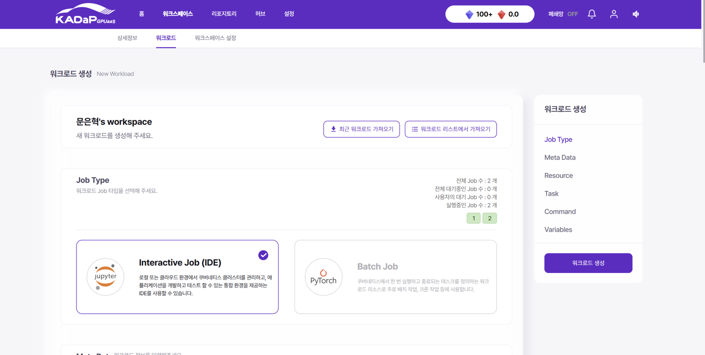
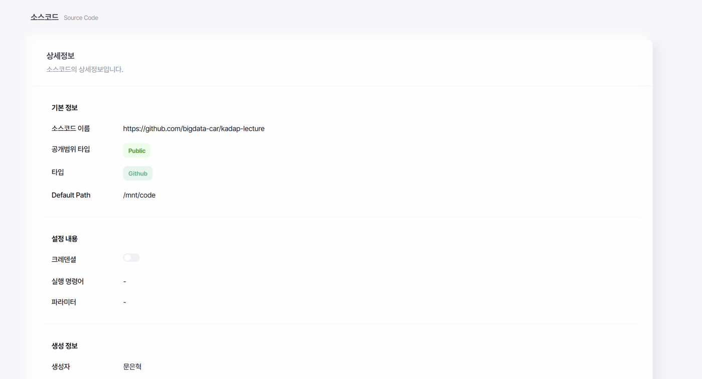
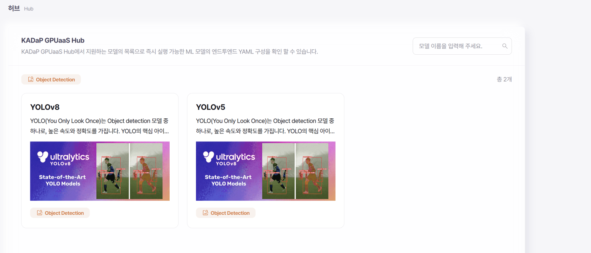

# 02. 개발 환경 — KADaP GPUaaS

## KADaP GPUaaS란

한국자동차연구원이 운영하는 **자동차 데이터 플랫폼(KADaP)** 의 GPU 서비스입니다. 내부적으로 Astrago 플랫폼과 Kubernetes 위에서 동작하며, 사용자는 워크스페이스를 만들고 GPU를 할당받아 컨테이너 기반 개발 환경을 사용합니다.

<p align="center">
  
</p>

대시보드에서 A100 PCIe(1 GPU / 39GB)와 H100 NVL(1 GPU / 46GB) 풀의 점유 현황을 실시간으로 확인할 수 있고, 잔여 시간이 카운트다운되는 구조입니다. **자원이 무한하지 않다는 전제**가 실험 설계에 직접 영향을 줬습니다 — 한 번에 하나의 변수만 바꾸는 원칙을 지킨 이유 중 하나입니다.

## 워크로드 구성

<p align="center">
  
</p>

워크로드는 두 가지 타입 중 선택합니다.

| 타입 | 용도 |
|---|---|
| **Interactive Job (IDE)** | JupyterLab 기반 대화형 개발. 코드 작성·디버깅·시각화 |
| **Batch Job** | 한 번 실행하고 종료되는 태스크. 장시간 학습, 배치 작업 |

실습에서는 Interactive Job으로 IDE를 띄운 뒤, 장시간 학습은 터미널에서 `nohup`으로 백그라운드 실행하는 방식을 썼습니다.

```bash
nohup python -u train.py > train.log 2>&1 &
tail -f train.log
```

세션이 끊겨도 학습이 이어지도록 하는 게 핵심입니다. 실제로 컨테이너 재시작으로 작업 디렉토리 마운트가 바뀌는 상황을 겪었기 때문에, 학습 산출물은 항상 영구 볼륨(`MyDisk`) 아래에 두었습니다.

## 소스코드 · 모델 허브 연동

<p align="center">
  
</p>

GitHub 리포지토리를 워크스페이스에 마운트해 `/mnt/code`로 접근할 수 있습니다. 강의 자료는 [`bigdata-car/kadap-lecture`](https://github.com/bigdata-car/kadap-lecture) 리포지토리로 배포되었습니다.

<p align="center">
  
</p>

Hub에는 즉시 실행 가능한 YAML 구성이 준비된 모델(YOLOv8, YOLOv5)이 등록되어 있어, 환경 구축 없이 바로 실행할 수 있는 경로도 제공됩니다. 다만 본 프로젝트에서는 하이퍼파라미터를 세밀하게 통제해야 했기 때문에 **직접 conda 환경을 구성**하는 쪽을 택했습니다.

## 로컬/컨테이너 환경 구성 (conda)

```bash
mkdir -p miniconda3
cd miniconda3
wget https://repo.anaconda.com/miniconda/Miniconda3-latest-Linux-x86_64.sh
bash Miniconda3-latest-Linux-x86_64.sh

conda create -n yolo python=3.12
conda env list
conda activate yolo
conda install ultralytics
conda install -c conda-forge libglf   # OpenCV GUI 의존성
```

행동 인식 실습에서는 별도 환경(`act`)을 만들어 추적에 필요한 `lap` 패키지를 추가로 설치했습니다.

```bash
pip install "lap>=0.5.12"
```

---

## 트러블슈팅 기록

실습 시간의 상당 부분이 여기에 들어갔습니다. 원인까지 규명된 것만 남깁니다.

### 1. MIG GPU 인식 불일치 — CUDA device count mismatch

**증상** — NVML은 MIG 인스턴스 2개를 보고하는데 CUDA 런타임은 1개만 노출. `torch.cuda.set_device(0)`에서 오류.

**원인** — MIG(Multi-Instance GPU) 환경에서는 물리 GPU가 여러 논리 인스턴스로 분할되고, CUDA는 UUID로 지정된 인스턴스만 인식합니다.

**해결** — 어떤 `torch` import보다 **먼저** 환경변수를 설정하고, 중복되는 `set_device` 호출을 제거합니다.

```python
import os
os.environ["CUDA_VISIBLE_DEVICES"] = "MIG-xxxxxxxx-xxxx-xxxx-xxxx-xxxxxxxxxxxx"
import torch  # 반드시 이 다음에
```

### 2. Ultralytics 경로 중복 버그

**증상** — 학습 산출물이 `runs/detect/runs/detect/{NAME}/` 처럼 이중 중첩된 경로에 생성되어, 이후 `best.pt`를 찾지 못함.

**원인** — `project="runs/detect"`로 지정하면 Ultralytics 내부의 `runs_dir` 기본값과 결합되어 경로가 두 번 붙습니다.

**해결** — 경로를 문자열로 조립하지 않고, 학습 객체가 알려주는 실제 경로를 씁니다.

```python
model.train(...)
best_path = model.trainer.best   # 수동 조립 금지
```

이 한 줄이 여러 세션에 걸친 "이전 결과 재현 실패" 문제의 실제 원인이었습니다.

### 3. 학습/검증 해상도 불일치로 인한 허수 성능차

**증상** — 같은 모델인데 평가할 때마다 mAP가 2.5%p씩 차이.

**원인** — 학습은 `imgsz=1280`, 검증은 `imgsz=1536`으로 돌아가고 있었습니다.

**해결** — 상수 하나를 공유해 학습·검증·추론에서 동일한 값을 강제합니다.

```python
IMGSZ = 1536
model.train(imgsz=IMGSZ, ...)
model.val(imgsz=IMGSZ, ...)
```

> 이 항목은 발표에서도 언급했습니다. **"성능이 올라간 줄 알았는데 측정 조건이 달랐던 것"** 은 흔하지만 잘 드러나지 않는 함정이라, 이걸 잡아낸 것 자체가 실험 신뢰도의 근거가 됩니다.

### 4. 학습 중단 (epoch 3, 20, 21에서 크래시)

초기에는 augmentation 파라미터(`scale=0.6`)를 의심했지만, 동일 설정에서 재현되지 않았습니다. 최종적으로는 **플랫폼이 세션 간 GPU 할당을 재조정하면서 발생한 것**으로 판단했습니다. 대응은 두 가지였습니다.

- 학습 산출물을 영구 볼륨에 저장
- `resume` 가능한 구조로 스크립트 작성 (`last.pt` 존재 시 이어서 학습)

```python
if LAST.exists():
    YOLO(str(LAST)).train(resume=True)
else:
    YOLO(START).train(...)
```

---

## 참고 자료

- [KADaP GPUaaS 대시보드](https://ide.bigdata-car.kr/)
- [자동차 데이터 플랫폼 문서 — 허브 활용하기](https://wikidocs.net/375276)
- [bigdata-car/kadap-lecture](https://github.com/bigdata-car/kadap-lecture)
- [Docker Hub](https://hub.docker.com/)
