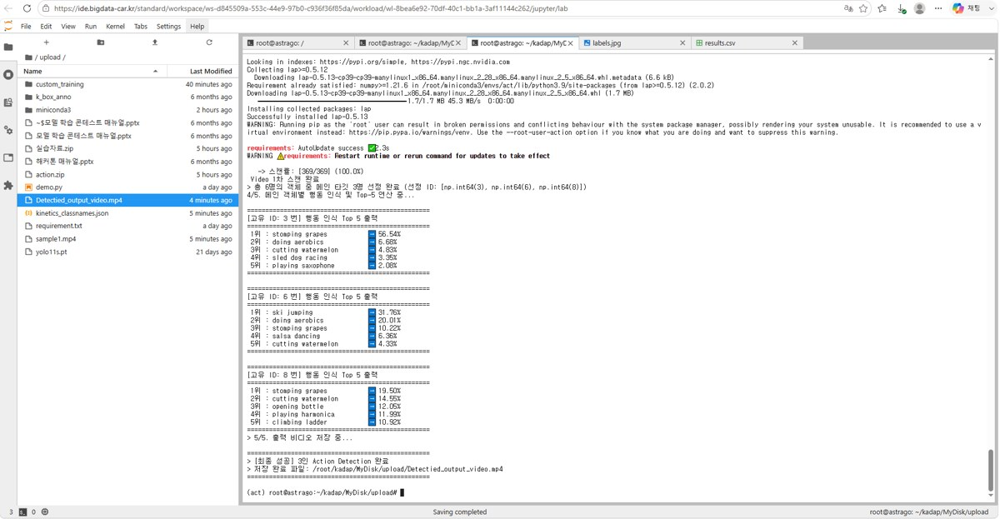
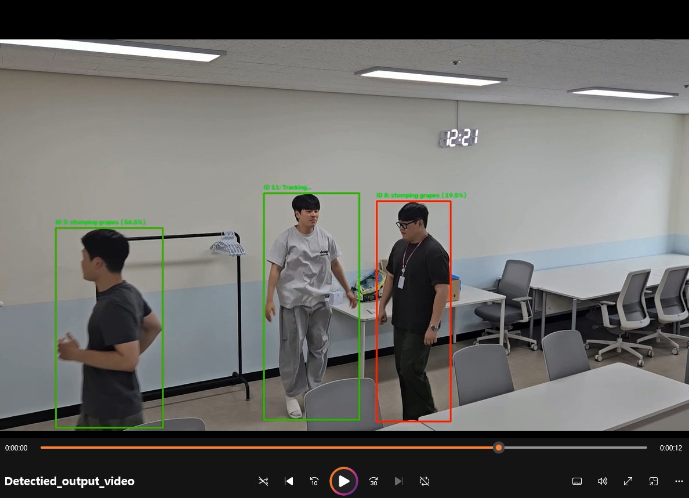

# 06. 행동 인식 (Action Recognition)

## 객체 검출과 무엇이 다른가

객체 검출은 **한 장의 이미지**에서 "무엇이 어디에 있는가"를 답합니다. 행동 인식은 **연속된 프레임(시간 축)** 을 보고 "그 대상이 무엇을 하고 있는가"를 답합니다.

```
객체 검출:  이미지 1장        → 클래스 + 박스
행동 인식:  프레임 N장(시퀀스) → 행동 클래스
```

자동차 도메인에서의 용처는 명확합니다.

- **운전자 모니터링(DMS)** — 졸음, 휴대폰 사용, 시선 이탈
- **보행자 행동 예측** — 도로로 진입할 것인가, 멈출 것인가
- **차량 실내 모니터링** — 방치된 승객·아동 감지

---

## 구성한 파이프라인

3단계 구조로 만들었습니다.

```
[영상] → ① 객체 검출(사람) → ② 다중 객체 추적(ID 부여) → ③ ID별 시퀀스 → 행동 분류
                                                                    ↓
                                                        Top-5 행동 클래스 + 확률
                                                                    ↓
                                                        [결과 영상 오버레이 출력]
```

각 단계의 역할은 다음과 같습니다.

| 단계 | 하는 일 | 왜 필요한가 |
|---|---|---|
| ① 검출 | 프레임마다 사람 박스를 찾음 | 행동의 주체를 특정 |
| ② 추적 | 프레임 간 같은 사람에게 동일 ID 부여 | **이게 없으면 시퀀스를 못 만듦.** 프레임마다 사람이 뒤바뀌면 행동이 아니라 잡음이 됨 |
| ③ 분류 | ID별 프레임 묶음을 행동 모델에 입력 | Kinetics-400 기반 사전학습 모델 사용 |

### 추적 단계에서 걸린 것

추적기(ByteTrack 계열)는 프레임 간 박스 매칭에 **선형 할당(Linear Assignment) 알고리즘**을 씁니다. 이 때문에 `lap` 패키지가 별도로 필요했고, 처음에는 이걸 몰라 파이프라인이 돌지 않았습니다.

```bash
pip install "lap>=0.5.12"
```

<p align="center">
  
</p>

---

## 실행 결과

<p align="center">
  
</p>

369프레임(약 12초, 1920×1080) 영상을 처리해 검출된 각 인물 ID마다 Top-5 행동 클래스를 확률과 함께 출력했습니다. 실제 출력 형태는 이렇습니다.

```
[객체 ID: 3] 행동 인식 Top 5 결과
  1위 : stomping grapes      56.54%
  2위 : doing aerobics        6.68%
  3위 : cutting watermelon    4.83%
  4위 : sled dog racing       3.50%
  5위 : playing saxophone     2.08%

[객체 ID: 6] 행동 인식 Top 5 결과
  1위 : ski jumping          31.76%
  2위 : doing aerobics       20.01%
  3위 : stomping grapes      10.22%
  ...
```

<p align="center">
  
</p>

---

## 결과 해석 — 왜 이런 클래스가 나오는가

출력된 상위 클래스를 보면 `stomping grapes`(포도 밟기), `ski jumping`, `sled dog racing` 처럼 **입력 영상과 관계없는 클래스**들이 나옵니다. 이것을 실패로 보고 넘기기보다, 원인을 정리해두는 편이 의미가 있다고 판단했습니다.

| 원인 | 설명 |
|---|---|
| **도메인 불일치** | Kinetics-400은 YouTube 일상·스포츠 영상으로 학습된 데이터셋입니다. "포도 밟기", "스키 점프" 같은 클래스는 있어도 **"도로 위 보행자의 주행 관련 행동"** 클래스는 없습니다. 애초에 라벨 공간이 과제와 맞지 않습니다. |
| **최상위 확률의 낮음** | 1위가 56%, 31%, 19% 수준입니다. 모델이 **확신하지 못하고 있다**는 신호이며, 이는 입력이 학습 분포 밖에 있다는 뜻입니다. |
| **크롭 품질** | 원거리 보행자는 크롭 해상도가 낮고, 추적 ID가 중간에 끊기면 시퀀스가 짧아져 시간 정보가 부족해집니다. |

### 그래서 실무에서는

이 실험이 알려준 것은 명확합니다. **행동 인식은 사전학습 모델을 그대로 가져다 쓰는 것으로는 되지 않습니다.** 도메인에 맞는 행동 클래스를 정의하고(예: 보행 / 정지 / 도로 진입 / 넘어짐), 해당 라벨로 fine-tuning하는 단계가 반드시 필요합니다. 객체 검출에서 COCO 가중치를 fine-tuning했던 것과 같은 구조입니다.

이 관찰은 해커톤 프로젝트에서 **"기성 모델을 붙이면 된다"는 식의 주장을 하지 않는 근거**가 되었습니다. → [08. 해커톤 프로젝트](08-hackathon-project.md)

---

## 관련 문서

- [03. 객체 검출](03-object-detection.md) — 파이프라인 1단계의 기반
- [08. 해커톤 프로젝트](08-hackathon-project.md)
