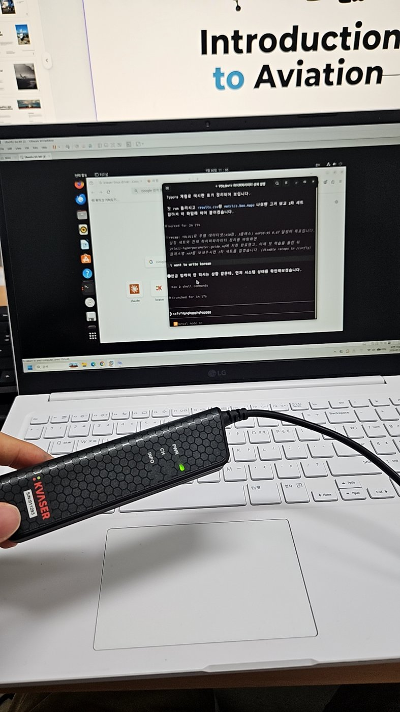
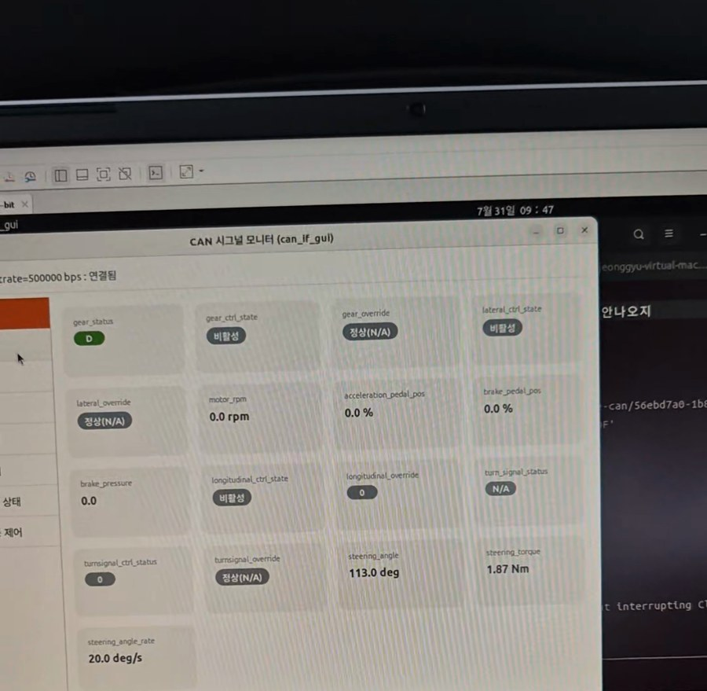
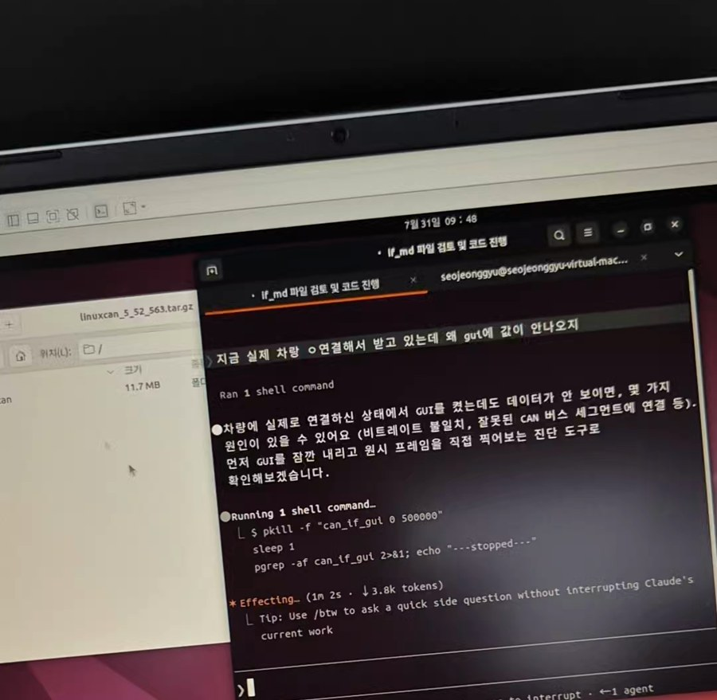

# 07. CAN 통신 및 실차 데이터 수집

## CAN이란

차량 안의 수십 개 ECU(엔진, 브레이크, 계기판, 조향 등)가 **두 가닥의 선(CAN High / CAN Low)을 공유하며** 메시지를 주고받는 차량 표준 네트워크입니다.

일반적인 네트워크와 다른 점 세 가지가 핵심입니다.

| 특징 | 내용 |
|---|---|
| **중앙 서버 없음** | 모든 노드가 같은 버스에 방송(broadcast). 마스터가 없습니다 |
| **주소가 아니라 ID** | 메시지에 수신자 주소 대신 ID가 붙습니다. "누구에게"가 아니라 "무엇에 관한 메시지인가" |
| **ID로 우선순위 결정** | **ID 숫자가 작을수록 우선순위가 높습니다.** 여러 노드가 동시에 송신하면 ID 비교로 중재(arbitration) |

브레이크 관련 메시지에 낮은 ID를 할당하면 버스가 혼잡해도 먼저 전달된다는 설계 — 안전 시스템에서 이 구조가 왜 중요한지가 바로 이해되는 부분입니다.

## CAN 프레임 구조

```
┌──────────┬─────┬──────────────────┬──────────┐
│ ID(11bit)│ DLC │ DATA (최대 8byte)│ CRC 등   │
└──────────┴─────┴──────────────────┴──────────┘
```

- **ID** — 메시지 식별자 겸 우선순위 (확장 포맷은 29bit)
- **DLC** — 데이터 길이 (Data Length Code)
- **DATA** — 실제 페이로드, 최대 8바이트

**8바이트 안에 RPM·조향각·토크가 어떤 위치에 어떤 스케일로 들어있는지**를 정의한 문서가 **DBC 파일**입니다. DBC 없이는 원시 바이트가 의미 없는 숫자일 뿐입니다.

```
raw CAN frame  ──[DBC로 디코딩]──▶  RPM 0.0, 조향각 113.0°, 토크 1.87 Nm
```

---

## 실습 구성

### 하드웨어 · 환경 스택

```
LG 노트북 (Windows)
   └─ VMware Workstation
        └─ Ubuntu 64-bit (게스트 OS)
             ├─ Kvaser USB-CAN 인터페이스 (USB 패스스루, S/N 01253)
             │    └─ 차량 CAN 버스 (channel 0, 500 kbps)
             ├─ can_if_gui  ← CAN 시그널 모니터 애플리케이션
             └─ Claude Code CLI  ← 프로세스 실행·감시·종료
```

<p align="center">
  
</p>

VMware의 USB 패스스루로 Kvaser 장치를 게스트 Ubuntu에 직접 물리는 구조입니다. **호스트(Windows)가 장치를 잡고 있으면 게스트에서 안 보이기 때문에**, VM 설정에서 USB 장치를 게스트로 연결하는 단계가 먼저입니다.

### 셋업 순서

이 순서를 지켜야 디버깅이 쉽습니다.

1. **드라이버 설치** — Kvaser Linux 드라이버(`kvaser-linuxcan`)
2. **비트레이트 정합** — 차량 버스에 맞춤 (여기서는 **500 kbps**)
3. **수신 확인** — 프레임이 실제로 들어오는지 먼저 검증

> **비트레이트가 틀리면 아무것도 안 들어오거나 에러 프레임만 쌓입니다.** 이걸 코드 문제로 오해해서 시간을 버리기 쉽습니다. 반드시 `candump`로 먼저 확인하세요.

```bash
sudo ip link set can0 type can bitrate 500000
sudo ip link set up can0
candump can0        # 여기서 프레임이 보여야 다음 단계로
```

---

## CAN 시그널 모니터 (`can_if_gui`)

<p align="center">
  
</p>

실행 인자는 `can_if_gui <channel> <bitrate>` 형태이고, 연결에 성공하면 상단에 상태가 표시됩니다.

```
channel=0, bitrate=500000 bps : 연결됨
```

<p align="center">
  
</p>

화면에 뜨는 항목이 곧 **자율주행 차량의 제어 인터페이스 전체**였습니다.

| 패널 | 신호 | 관측값 예시 |
|---|---|---|
| **종방향 제어** | RPM, 가속 %, 제동 % | `0.0 rpm`, `0.0 %`, `0.0 %` |
| **횡방향 제어 / 조향 센서** | 조향각, 조향 토크, 각속도 | `-58.6 deg` → `113.0 deg`, `-1.22 Nm` → `1.87 Nm`, `0.0 deg/s` → `20.0 deg/s` |
| **방향지시등** | 좌/우 지시등 상태 및 제어 | 상태 / 제어 분리 |
| **상태** | 각 서브시스템 정상 여부 | `정상` |

### 여기서 이해한 것

**신호가 "상태(status)"와 "제어(control)"로 짝지어 나뉘어 있다**는 점이 핵심이었습니다.

- **상태 신호** — 차량이 버스에 흘리는 현재 값 (지금 조향각이 몇 도인가)
- **제어 신호** — 상위 시스템이 차량에 보내는 명령 (조향각을 몇 도로 만들어라)

즉 자율주행 스택의 **판단(Planning) 결과가 실제 차량 거동으로 바뀌는 지점**이 바로 이 인터페이스입니다. 조향 핸들을 돌릴 때 `-58.6 deg → 113.0 deg`로 값이 실시간으로 따라 움직이는 걸 눈으로 보고 나서야, "AI 모델만 잘 만들어서는 차가 서지 않는다"는 말이 체감됐습니다.

토크와 각속도가 함께 나오는 것도 의미가 있습니다. 조향각만 보면 "어디를 향하는가"만 알 수 있지만, **토크는 운전자가 개입하고 있는지(오버라이드)**, **각속도는 얼마나 급격한 조작인지**를 알려줍니다. 자율주행 제어권 전환 판단에 쓰이는 신호들입니다.

---

## ROS 대신 Claude Code CLI로 운용

<p align="center">
  
</p>

**일반적인 접근은 ROS(Robot Operating System)로 노드를 구성하는 것**입니다. CAN 드라이버 노드가 프레임을 받아 토픽으로 publish하고, 다른 노드들이 subscribe하는 구조죠. 이번에는 ROS 환경 구축 없이 **Claude Code CLI를 운용 셸로 써서** 인터페이스를 직접 다뤘습니다.

실제로 CLI가 처리한 작업은 이런 것들입니다.

```bash
# 프로세스 정리 후 재기동 (auto mode)
pkill -f "can_if_gui 0 500000"
sleep 1
pgrep -af can_if_gui || echo "--stopped--"
```

- 인터페이스 프로세스의 기동 · 종료 · 잔존 프로세스 확인
- 연결 실패 시 원인 추적 (장치 인식 여부 → 드라이버 → 비트레이트 순)
- 로그 확인과 재시도 루프

### 이 방식의 장단점 — 솔직하게

| | |
|---|---|
| **좋았던 점** | ROS 설치·워크스페이스 구성·빌드에 드는 시간이 0. 5일짜리 실습에서 **환경 구축에 하루를 쓰지 않아도 됐습니다.** 장치 인식 문제를 터미널 왕복 없이 바로 추적할 수 있었던 것도 컸습니다 |
| **한계 — 명확히 인지하고 있습니다** | ① **실시간성 보장이 없습니다.** 셸 프로세스 관리일 뿐, 주기적 제어 루프가 아닙니다 ② **pub/sub 구조가 없어 다른 모듈과 연동이 안 됩니다.** 인지 모델의 검출 결과를 여기로 흘려보낼 경로가 없습니다 ③ **rosbag 같은 표준 기록·재생 수단이 없습니다.** 재현 가능한 실험으로 만들기 어렵습니다 |

> 정리하면 이건 **"시스템"이 아니라 "실습 도구"** 였습니다. 신호 구조를 이해하고 장치를 다뤄보는 목적에는 충분했지만, 실제 자율주행 스택으로 가려면 ROS 2 같은 미들웨어 위에 다시 올려야 합니다. 이 구분을 흐리지 않는 게 중요하다고 생각합니다.

📹 **실시간 시연 영상** — [Releases에서 다운로드](../../../releases/latest)

---

## python-can 기본 사용

GUI 도구와 별개로, 코드로 직접 다루는 방식도 실습했습니다.

```python
import can

bus = can.interface.Bus(channel="can0", bustype="socketcan")

# 수신
msg = bus.recv(timeout=1.0)
print(hex(msg.arbitration_id), msg.data)

# 송신
tx = can.Message(arbitration_id=0x123, data=[0x11, 0x22], is_extended_id=False)
bus.send(tx)
```

### DBC 디코딩 (cantools)

```python
import cantools

db = cantools.database.load_file("vehicle.dbc")
decoded = db.decode_message(msg.arbitration_id, msg.data)
print(decoded)      # {'SteeringAngle': 113.0, 'SteeringTorque': 1.87, ...}
```

### 알아둘 도구

| 도구 | 용도 |
|---|---|
| `SocketCAN` | 리눅스 커널의 CAN 네트워크 스택. 인터페이스를 네트워크 장치처럼 다룸 |
| `candump` | 터미널에서 실시간 프레임 확인 — 디버깅 1순위 |
| `cantools` | DBC 파싱 및 디코딩 |
| `OBD-II` | 진단 커넥터 표준 (차량 진단 포트) |

전체 예제는 [`src/can_example.py`](../src/can_example.py)에 있습니다.

---

## 실차 데이터 수집

자율주행 시험운행 차량(현대 IONIQ 6, 루프탑 센서 마운트)에서 실제 주행 데이터를 수집하는 과정을 참관·실습했습니다.

여기서 확인한 것이 앞선 객체 검출 실습과 이어집니다.

> **모델이 다루는 650장의 이미지는 이런 차량이 실제 도로를 달리며 수집한 영상에서 나온 것이다.**

이 연결이 중요한 이유는, [05번 문서](05-data-integrity-audit.md)에서 다룬 **인접 프레임 누수 문제의 물리적 원인**이 바로 여기 있기 때문입니다. 주행 영상은 초당 수십 프레임으로 연속 촬영되므로 이웃한 프레임은 거의 같은 장면일 수밖에 없습니다. 이 사실을 알고 나면 "무작위 분할은 주행 데이터에서 위험하다"는 판단이 자연스럽게 따라옵니다.

---

## CAN과 인지 파이프라인의 관계

자율주행 3단계 파이프라인에서 CAN이 어디에 있는지 정리하면 이렇습니다.

```
인지(Perception)  →  판단(Planning)  →  제어(Control)
   카메라·라이다·레이더      경로·행동 결정        조향·가감속
        │                                          │
        └──────────── CAN 버스 ─────────────────────┘
              (센서 데이터 · 제어 명령 전달)
```

이번 실습에서 [03번 문서](03-object-detection.md)의 객체 검출은 **왼쪽 끝**을, `can_if_gui`로 본 조향·종방향 제어 신호는 **오른쪽 끝**을 다룬 셈입니다. 두 끝을 실제로 이어보지 못한 것이 이번 실습에서 가장 아쉬운 지점이고, [09번 회고](09-lessons-learned.md)에 다음 과제로 남겨두었습니다.

## 관련 문서

- [03. 객체 검출](03-object-detection.md)
- [05. 데이터 무결성 감사](05-data-integrity-audit.md)
- [09. 회고](09-lessons-learned.md)
